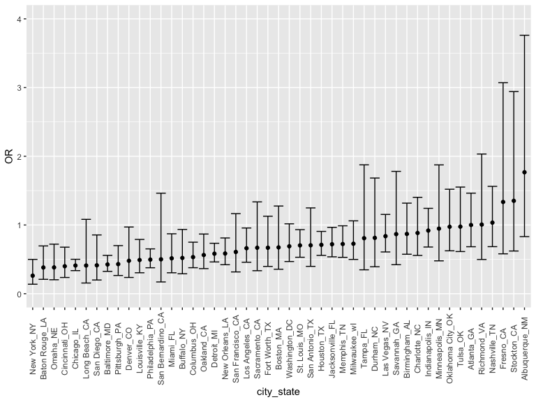
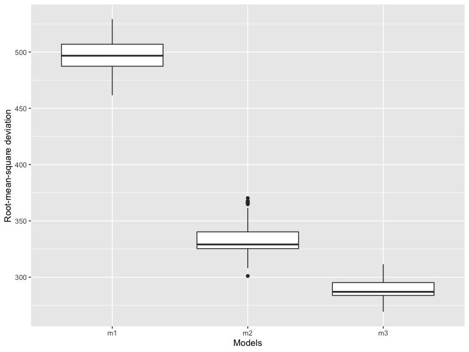

p8105_hw6_zl3118
================
Shirley Liang
2022-11-28

``` r
weather_df = 
  rnoaa::meteo_pull_monitors(
    c("USW00094728"),
    var = c("PRCP", "TMIN", "TMAX"), 
    date_min = "2017-01-01",
    date_max = "2017-12-31") %>%
  mutate(
    name = recode(id, USW00094728 = "CentralPark_NY"),
    tmin = tmin / 10,
    tmax = tmax / 10) %>%
  select(name, id, everything())
```

    ## using cached file: ~/Library/Caches/R/noaa_ghcnd/USW00094728.dly

    ## date created (size, mb): 2022-11-27 22:11:09 (8.426)

    ## file min/max dates: 1869-01-01 / 2022-11-30

``` r
boot_sample = function(df) {
  sample_frac(df, replace = TRUE)}
  
bootstrapping = 
  tibble(
    strap_number = 1:5000,
    strap_sample = rerun(5000, boot_sample(weather_df))
  )

bootstrap_results_r = 
  bootstrapping %>% 
  mutate(
    models = map(strap_sample, ~lm(tmax~tmin, data = .x)), 
    results1 = map(models, broom::glance)
  ) %>%
  select(-strap_sample, -models) %>% 
  unnest(results1)
bootstrap_results_r %>% 
  ggplot(aes(x = r.squared)) + geom_density()
```


The distribution is approximately normal and slightly skew to the left.

``` r
bootstrap_results_beta = 
  bootstrapping %>% 
  mutate(
    models = map(strap_sample, ~lm(tmax ~ tmin, data = .x)),
    results2 = map(models, broom::tidy)
  ) %>% 
  select(-strap_sample, -models) %>% 
  unnest(results2)

bootstrap_results_log = 
  bootstrap_results_beta %>% 
  select(strap_number, term, estimate) %>% 
  pivot_wider(
    names_from = term, 
    values_from = estimate
  ) %>% 
  mutate(log = log(`(Intercept)`*`tmin`))
ggplot(bootstrap_results_log, aes(x = log)) + geom_density()
```


The distribution is also approximately normal, a little tail extending
to lower values, which indicates there might be large outliers included.

``` r
bootstrap_results_r %>% 
  summarise(
    ci_lower = quantile(r.squared, 0.025),
    ci_upper = quantile(r.squared, 0.975)
  ) %>% 
  knitr::kable()
```

|  ci_lower |  ci_upper |
|----------:|----------:|
| 0.8936827 | 0.9271278 |

``` r
bootstrap_results_log %>% 
  summarise(
    ci_lower = quantile(log, 0.025), 
    ci_upper = quantile(log, 0.975)
  ) %>% 
  knitr::kable()
```

| ci_lower | ci_upper |
|---------:|---------:|
| 1.964711 | 2.059229 |

The 95% confidence intervals are `(0.8940, 0.9274)` and
`(1.9657,2.0586)` for `r-squared` and `log(beta0*beta1)`, respectively.

``` r
homicides = read_csv("./homicide-data.csv")
```

    ## Rows: 52179 Columns: 12
    ## ── Column specification ────────────────────────────────────────────────────────
    ## Delimiter: ","
    ## chr (9): uid, victim_last, victim_first, victim_race, victim_age, victim_sex...
    ## dbl (3): reported_date, lat, lon
    ## 
    ## ℹ Use `spec()` to retrieve the full column specification for this data.
    ## ℹ Specify the column types or set `show_col_types = FALSE` to quiet this message.

``` r
homicides_clean = homicides %>% 
  janitor::clean_names() %>% 
  mutate(city_state = str_c(city, state, sep = "_")) %>% 
  filter(!city_state %in% c("Dallas_TX", "Phoenix_AZ", "Kansas City_MO", "Tulsa_AL"), 
         victim_race %in% c("Black", "White")) %>% 
  mutate(victim_age = as.numeric(victim_age),
         resolved = as.numeric(disposition == "Closed by arrest"),
         victim_race = fct_relevel(victim_race, "White"),
         victim_sex = fct_relevel(victim_sex, "Female"))

baltimore_glm = homicides_clean %>% 
  filter(city_state == "Baltimore_MD") %>% 
  glm(resolved ~ victim_age + victim_sex + victim_race, family = binomial(), data = .) %>% 
  broom::tidy()

baltimore_glm
```

    ## # A tibble: 4 × 5
    ##   term             estimate std.error statistic  p.value
    ##   <chr>               <dbl>     <dbl>     <dbl>    <dbl>
    ## 1 (Intercept)       1.15      0.237        4.87 1.14e- 6
    ## 2 victim_age       -0.00673   0.00332     -2.02 4.30e- 2
    ## 3 victim_sexMale   -0.854     0.138       -6.18 6.26e-10
    ## 4 victim_raceBlack -0.842     0.175       -4.82 1.45e- 6

``` r
baltimore_OR = baltimore_glm %>% 
  mutate(OR = exp(estimate),
         CI_lower = exp(estimate - 1.96 * std.error),
         CI_upper = exp(estimate + 1.96 * std.error))

baltimore_OR %>%
  filter(term == "victim_sexMale") %>%
  select(term, OR, CI_lower, CI_upper) %>% 
  knitr::kable(digits = 2)
```

| term           |   OR | CI_lower | CI_upper |
|:---------------|-----:|---------:|---------:|
| victim_sexMale | 0.43 |     0.32 |     0.56 |

The adjusted odds ratio for solving homicides in Baltimore comparing
male victims to female victims keeping all other variables fixed is
0.4255117 with 95% CI (0.324559, 0.5578655).

``` r
city_glm = homicides_clean %>% 
  nest(all_cities = -city_state) %>%
  mutate(models = map(.x = all_cities, ~glm(resolved ~ victim_age + victim_sex + victim_race, family = binomial(), data = .)), results = map(models, broom::tidy)) %>% 
  select(-models, -all_cities) %>% 
  unnest(cols = results) %>% 
  mutate(OR = exp(estimate), CI_lower = exp(estimate - 1.96 * std.error), CI_upper = exp(estimate + 1.96 * std.error)) %>% 
  filter(term == "victim_sexMale") %>% 
  select(city_state, OR, CI_lower, CI_upper)

city_glm %>% 
  knitr::kable(digits = 2)
```

| city_state        |   OR | CI_lower | CI_upper |
|:------------------|-----:|---------:|---------:|
| Albuquerque_NM    | 1.77 |     0.83 |     3.76 |
| Atlanta_GA        | 1.00 |     0.68 |     1.46 |
| Baltimore_MD      | 0.43 |     0.32 |     0.56 |
| Baton Rouge_LA    | 0.38 |     0.21 |     0.70 |
| Birmingham_AL     | 0.87 |     0.57 |     1.32 |
| Boston_MA         | 0.67 |     0.36 |     1.28 |
| Buffalo_NY        | 0.52 |     0.29 |     0.94 |
| Charlotte_NC      | 0.88 |     0.56 |     1.40 |
| Chicago_IL        | 0.41 |     0.34 |     0.50 |
| Cincinnati_OH     | 0.40 |     0.24 |     0.68 |
| Columbus_OH       | 0.53 |     0.38 |     0.75 |
| Denver_CO         | 0.48 |     0.24 |     0.97 |
| Detroit_MI        | 0.58 |     0.46 |     0.73 |
| Durham_NC         | 0.81 |     0.39 |     1.68 |
| Fort Worth_TX     | 0.67 |     0.40 |     1.13 |
| Fresno_CA         | 1.34 |     0.58 |     3.07 |
| Houston_TX        | 0.71 |     0.56 |     0.91 |
| Indianapolis_IN   | 0.92 |     0.68 |     1.24 |
| Jacksonville_FL   | 0.72 |     0.54 |     0.97 |
| Las Vegas_NV      | 0.84 |     0.61 |     1.15 |
| Long Beach_CA     | 0.41 |     0.16 |     1.08 |
| Los Angeles_CA    | 0.66 |     0.46 |     0.96 |
| Louisville_KY     | 0.49 |     0.30 |     0.79 |
| Memphis_TN        | 0.72 |     0.53 |     0.99 |
| Miami_FL          | 0.52 |     0.30 |     0.87 |
| Milwaukee_wI      | 0.73 |     0.50 |     1.06 |
| Minneapolis_MN    | 0.95 |     0.48 |     1.87 |
| Nashville_TN      | 1.03 |     0.68 |     1.56 |
| New Orleans_LA    | 0.58 |     0.42 |     0.81 |
| New York_NY       | 0.26 |     0.14 |     0.50 |
| Oakland_CA        | 0.56 |     0.37 |     0.87 |
| Oklahoma City_OK  | 0.97 |     0.62 |     1.52 |
| Omaha_NE          | 0.38 |     0.20 |     0.72 |
| Philadelphia_PA   | 0.50 |     0.38 |     0.65 |
| Pittsburgh_PA     | 0.43 |     0.27 |     0.70 |
| Richmond_VA       | 1.01 |     0.50 |     2.03 |
| San Antonio_TX    | 0.70 |     0.40 |     1.25 |
| Sacramento_CA     | 0.67 |     0.33 |     1.34 |
| Savannah_GA       | 0.87 |     0.42 |     1.78 |
| San Bernardino_CA | 0.50 |     0.17 |     1.46 |
| San Diego_CA      | 0.41 |     0.20 |     0.85 |
| San Francisco_CA  | 0.61 |     0.32 |     1.17 |
| St. Louis_MO      | 0.70 |     0.53 |     0.93 |
| Stockton_CA       | 1.35 |     0.62 |     2.94 |
| Tampa_FL          | 0.81 |     0.35 |     1.88 |
| Tulsa_OK          | 0.98 |     0.61 |     1.55 |
| Washington_DC     | 0.69 |     0.47 |     1.02 |

``` r
full_plot = city_glm %>% 
  mutate(city_state = fct_reorder(city_state, OR)) %>% 
  ggplot(aes(x = city_state, y = OR)) +
  geom_point() +
  ylim(0, 4) +
  geom_errorbar(aes(ymin = CI_lower, ymax = CI_upper)) + 
  theme(axis.text.x = element_text(angle = 90, vjust = 0.5, hjust = 0.5))

full_plot
```



From the plot above, we see the lowest adjusted OR is from New York and
highest is from Albuquerque. Around 90% of the cities have a adjusted OR
below 1. Those cities have odds of having a resolved homicide lower
among male victims than that of female victims, adjusting for age and
race. The cities on the right side with adjusted OR greater than one
have the reversed finding. The odds of having a resolved homicide higher
among male victims than that of female victims, adjusting for age and
race.

``` r
birthweight_df = read_csv("./birthweight.csv")
```

    ## Rows: 4342 Columns: 20
    ## ── Column specification ────────────────────────────────────────────────────────
    ## Delimiter: ","
    ## dbl (20): babysex, bhead, blength, bwt, delwt, fincome, frace, gaweeks, malf...
    ## 
    ## ℹ Use `spec()` to retrieve the full column specification for this data.
    ## ℹ Specify the column types or set `show_col_types = FALSE` to quiet this message.

``` r
birthweight_clean = birthweight_df %>% 
  mutate(babysex = as.factor(babysex),
         frace = as.factor(frace),
         malform = as.factor(malform),
         mrace = as.factor(mrace)) 

missing_data <- sum(is.na(birthweight_clean))
```

There is no missing data (missing_data = 0).

I picked weight gain for regression analyses. It is based on the
hypothesis that mom who gain more weight during pregnancy period can
have a higher birth weight baby. And it is commonly seen in clinical
that control weight of mom can help control the size of the baby. Based
on the regression analysis below, we see a positive association between
weight gain and baby birth weight. The more mom gained weight during
pregnancy, the higher baby’s birth weight will be. The plot of model
residuals is also showed below

``` r
weightgain_reg = lm(bwt ~ wtgain, data = birthweight_clean)

weightgain_reg
```

    ## 
    ## Call:
    ## lm(formula = bwt ~ wtgain, data = birthweight_clean)
    ## 
    ## Coefficients:
    ## (Intercept)       wtgain  
    ##     2858.91        11.57

``` r
residuals = birthweight_clean %>% 
  select(bwt, wtgain) %>% 
  modelr::add_residuals(weightgain_reg) %>% 
  modelr::add_predictions(weightgain_reg)

residuals %>% ggplot(aes(x = wtgain, y = resid)) + geom_boxplot() + labs(x = "weight gain during pregnancy", y = "residual")
```


``` r
model2 = lm(bwt ~ blength + gaweeks, data = birthweight_clean)
model2
```

    ## 
    ## Call:
    ## lm(formula = bwt ~ blength + gaweeks, data = birthweight_clean)
    ## 
    ## Coefficients:
    ## (Intercept)      blength      gaweeks  
    ##    -4347.67       128.56        27.05

``` r
model3 = lm(bwt ~ bhead + blength + babysex + bhead*blength + bhead*babysex + blength*babysex + bhead*blength*babysex, data = birthweight_clean)
model3
```

    ## 
    ## Call:
    ## lm(formula = bwt ~ bhead + blength + babysex + bhead * blength + 
    ##     bhead * babysex + blength * babysex + bhead * blength * babysex, 
    ##     data = birthweight_clean)
    ## 
    ## Coefficients:
    ##            (Intercept)                   bhead                 blength  
    ##             -7176.8170                181.7956                102.1269  
    ##               babysex2           bhead:blength          bhead:babysex2  
    ##              6374.8684                 -0.5536               -198.3932  
    ##       blength:babysex2  bhead:blength:babysex2  
    ##              -123.7729                  3.8781

``` r
crossvalidation = crossv_mc(birthweight_clean, 100) %>% 
  mutate(train = map(train, as_tibble), test = map(test, as_tibble)) %>% 
  mutate(m1 = map(train, ~lm(bwt ~ wtgain, data = .x)), 
         m2 = map(train, ~lm(bwt ~ blength + gaweeks, data = .x)), 
         m3 = map(train, ~lm(bwt ~ bhead + blength + babysex + bhead*blength + bhead*babysex 
                 + blength*babysex + bhead*blength*babysex, data = .x))) %>% 
  mutate(rmse_m1 = map2_dbl(m1, test, ~rmse(model = .x, data = .y)), 
         rmse_m2 = map2_dbl(m2, test, ~rmse(model = .x, data = .y)), 
         rmse_m3 = map2_dbl(m3, test, ~rmse(model = .x, data = .y)))

crossvalidation_plot = crossvalidation %>% 
  select(starts_with("rmse")) %>% 
  pivot_longer(everything(), 
               names_to = "model",
               values_to = "rmse",
               names_prefix = "rmse_") %>% 
  ggplot(aes(x = model, y = rmse)) + geom_boxplot() + labs(x = "Models", y = "Root-mean-square deviation")

crossvalidation_plot
```



Comparing between the models in the plot, model 1 have the highest
root-mean-square deviation, follow by model 2, and model 3 have the
lowest root-mean-square deviation. Model 3 would be the best model due
to the smallest root-mean-square deviation.
